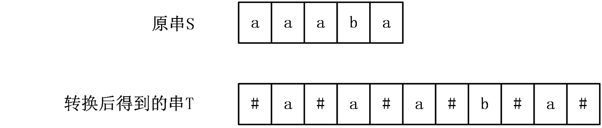
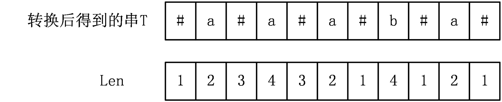
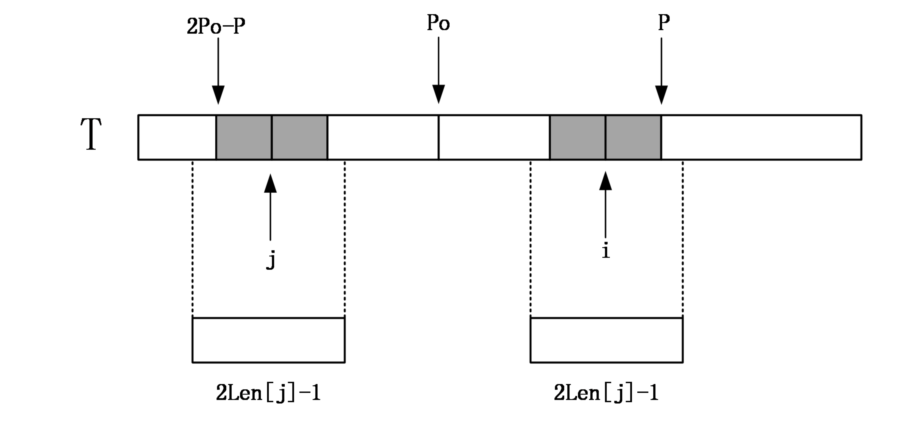
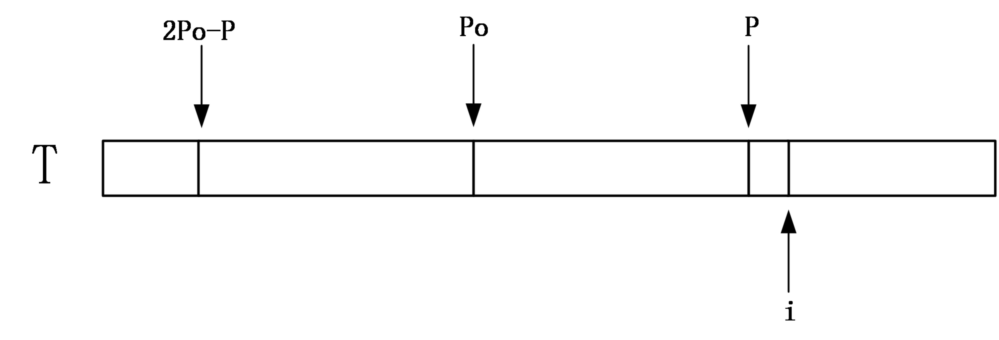

#### Manacher算法

https://blog.csdn.net/dyx404514/article/details/42061017

用于求解最长回文子串问题。`abba` 这样的字符串是回文的。

1. 为了解决字符串个数的奇偶性问题。采用向每两个字符中间以及字符串开头和结尾插入一个分隔符，这样字符串就能够转化为奇数个字符的字符串。



引入一个辅助数组`len[i]`，来表示以字符T[i]为中心的回文串的半径。



可以发现，`len[i]-1`，**对应于原串S中的`S[i]`,对应的最长回文子串的长度**。

### Len数组的计算

首先设P为之前计算过程中回文串的右端点最大值，po为取得这个最大值的中心点位置。在计算i的时候$0\le j<i$ ，len[j]已经完成计算了。

设当前计算到位置i。

#### i<=P

首先取得i关于Po的对称点j。

**len[j]+i<P**，以i为中心的回文串在以Po为中心的回文串内部。

根据对称性有**len[i]=len[j]**


**len[j]+i>=P**，说明此时以i为中心的回文串可能会在P的外面，此时需要对大于P的部分一个一个进行匹配。



### i>P

此时由于之前没有对以i为中心的字符串进行匹配，所以此时只能一个一个进行匹配了。



```cpp
const int maxn=1000010;
char str[maxn];//原字符串
char tmp[maxn<<1];//转换后的字符串
int Len[maxn<<1];
//转换原始串
int INIT(char *st)
{
    int i,len=strlen(st);
    tmp[0]='@';//字符串开头增加一个特殊字符，防止越界
    for(i=1;i<=2*len;i+=2)
    {
        tmp[i]='#';
        tmp[i+1]=st[i/2];
    }
    tmp[2*len+1]='#';
    tmp[2*len+2]='$';//字符串结尾加一个字符，防止越界
    tmp[2*len+3]=0;
    return 2*len+1;//返回转换字符串的长度
}
//Manacher算法计算过程
int MANACHER(char *st,int len)
{
     int mx=0,ans=0,po=0;//mx即为当前计算回文串最右边字符的最大值
     for(int i=1;i<=len;i++)
     {
         if(mx>i)
         Len[i]=min(mx-i,Len[2*po-i]);//在Len[j]和mx-i中取个小
         else
         Len[i]=1;//如果i>=mx，要从头开始匹配
         //针对i>P和len[j]+i<P的情况进行计算
         while(st[i-Len[i]]==st[i+Len[i]])
         Len[i]++;
         if(Len[i]+i>mx)//若新计算的回文串右端点位置大于mx，要更新po和mx的值
         {
             mx=Len[i]+i;
             po=i;
         }
         ans=max(ans,Len[i]);
     }
     return ans-1;//返回Len[i]中的最大值-1即为原串的最长回文子串额长度 
  }
```

