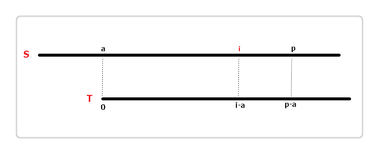
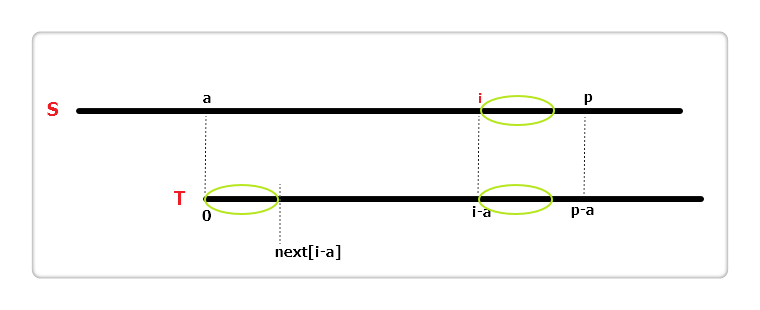
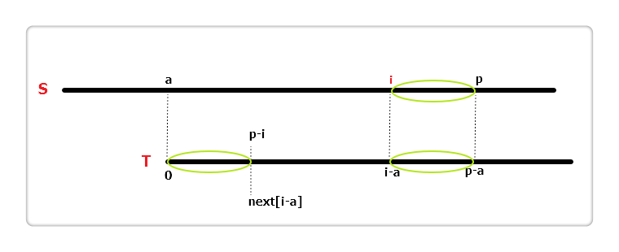
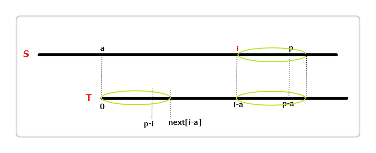

https://segmentfault.com/a/1190000008663857

https://blog.csdn.net/dyx404514/article/details/41831947

拓展KMP算法要解决的问题是：

给定字符串S和模式串T，求解字符串的所有前缀`S[0],S[1]..,S[len-1]`和模式串T的最长公共前缀的长度。结果记录在`extend[i]`中。

例如

| i         | 0    | 1    | 2    | 3    | 4    | 5    | 6    | 7    |
| --------- | ---- | ---- | ---- | ---- | ---- | ---- | ---- | ---- |
| S         | a    | a    | a    | a    | a    | b    | b    | b    |
| T         | a    | a    | a    | a    | a    | c    |      |      |
| extend[i] | 6    | 4    | 3    | 2    | 1    | 0    | 0    | 0    |

​	在拓展KMP中定义了两个变量`a`和`p`，代表模式串T从字符串S位置为a的地方开始匹配，最长能够匹配到长度为p的位置上。此时`S[p]!=T[p-a]`，即最长匹配位置的后一个位置。这两个变量在算法的过程中会被更新。

​	此外，在拓展KMP中还定义了一个辅助数组`next[i]`，和KMP算法的`next[i]`数组意义不同。拓展KMP算法中的`next[i]`代表了模式串T位置`i`开始，能够和前缀匹配的最大长度。

| i       | 0    | 1    | 2    | 3    | 4    | 5    |
| ------- | ---- | ---- | ---- | ---- | ---- | ---- |
| T       | a    | a    | a    | a    | a    | c    |
| next[i] | 6    | 4    | 3    | 2    | 1    | 0    |

### 算法流程

假设当前匹配到位置i。

##### i+next[i-a]
p

