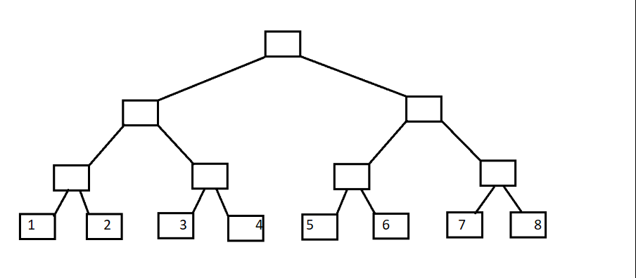

[解析](https://www.cnblogs.com/hsd-/p/6139376.html)

```cpp
int lowbit(int t)
{
	return t&(-t);
}
```

```cpp
void add(int x,int y)
{
	for(int i=x;i<=n;i+=lowbit(i))
	tree[i]+=y;
}
```

```cpp
int getsum(int x)
{
	int ans=0;
	for(int i=x;i>0;i-=lowbit(i))
	ans+=tree[i];
	return ans;
}
```

树状数组  重点是在**树状**的数组大家都知道二叉树吧叶子结点代表A数组A[1]~A[8]



现在变形一下


现在定义每一列的顶端结点C[]数组  如下图


C[i]代表 子树的叶子结点的权值之和// **这里以求和举例**

如图可以知道

C[1]=A[1];

C[2]=A[1]+A[2];

C[3]=A[3];

C[4]=A[1]+A[2]+A[3]+A[4];

C[5]=A[5];

C[6]=A[5]+A[6];

C[7]=A[7];

C[8]=A[1]+A[2]+A[3]+A[4]+A[5]+A[6]+A[7]+A[8];

下面观察如下图


将C[]数组的结点序号转化为**二进制**

1=(001)      C[1]=A[1];

2=(010)      C[2]=A[1]+A[2];

3=(011)      C[3]=A[3];

4=(100)      C[4]=A[1]+A[2]+A[3]+A[4];

5=(101)      C[5]=A[5];

6=(110)      C[6]=A[5]+A[6];

7=(111)      C[7]=A[7];

8=(1000)    C[8]=A[1]+A[2]+A[3]+A[4]+A[5]+A[6]+A[7]+A[8];

对照式子可以发现  **C[i]=A[i-2^k+1]+A[i-2^k+2]+......A[i]; （k为i的二进制中从最低位到高位连续零的长度）例如i=8时，k=3;**

可以自行带入验证;

现在引入lowbit(x) 

lowbit(x) 其实就是取出x的最低位1  换言之 lowbit(x)=2^k  k的含义与上面相同 理解一下

#### **区间查询**

下面利用C[i]数组，求A数组中前i项的和 

1. 举个例子 i=7;

   sum[7]=A[1]+A[2]+A[3]+A[4]+A[5]+A[6]+A[7] ;   前i项和

   C[4]=A[1]+A[2]+A[3]+A[4];   C[6]=A[5]+A[6];   C[7]=A[7];

   可以推出:   sum[7]=C[4]+C[6]+C[7];

   序号写为二进制: sum[(111)]=C[(100)]+C[(110)]+C[(111)];

2. 再举个例子 i=5

   sum[7]=A[1]+A[2]+A[3]+A[4]+A[5] ;   前i项和

   C[4]=A[1]+A[2]+A[3]+A[4];   C[5]=A[5];

   可以推出:   sum[5]=C[4]+C[5];

   序号写为二进制: sum[(101)]=C[(100)]+C[(101)];


### 二维树状数组

**add x y v                                     在(x, y)加上一个值v**

**sum(x, y)           求矩形区域(1, 1) - (x, y)内的值的和**

```cpp
void add(int x,int y,int v)
{
	for(int i = x; i <= n; i += lowbit(i))
    {
		for(int j = y; j <= n; j += lowbit(j))
        {
                c[i][j]+= v;
        }
    }
}
```

```cpp
 int sum(int x,int y)
 {
        int s =0;
        for(int i = x; i ; i -= lowbit(i))
        {
            for(int j = y; j ; j -= lowbit(j))
            { 
                s += c[i][j];
            }
        }
        return s;
}
```

### 逆序模型

朴素的数组`bit[i]`表示数字i出现了`bit[i]`次，然后将数组`bit[i]`转化为树状数组来维护。

遍历n个元素，当访问到元素Xi时，使用树状数组求出[0,Xi-1]各个数字出现的总次数，也就求和bit[1,Xi]。这里Xi要加一。$\sum i-sum(X_i)$就是逆序数的个数。

典型例题：https://vjudge.net/problem/HDU-1394